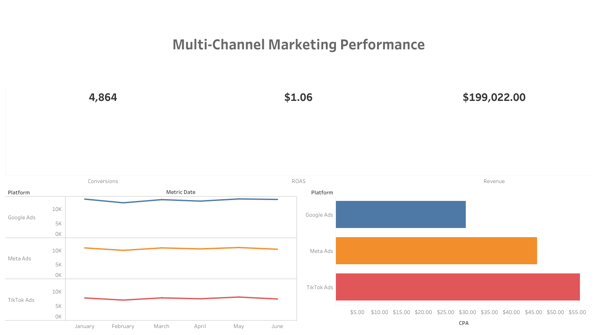

# Multi-Channel Marketing Data Pipeline & BI Platform

An end-to-end data ingestion pipeline and business intelligence solution designed to automate the collection, normalization, and visualization of multi-channel digital advertising metrics. This project replaces manual spreadsheet aggregation with an automated programmatic ETL pipeline.

## Architecture Overview
1. **Extract / Ingest:** A FastAPI microservice receives daily performance CSV exports from Google Ads, Meta Ads, and TikTok Ads.
2. **Transform / Normalize:** Utilizes OpenAI's Pydantic structured outputs as a dynamic header-row interpreter to normalize disparate platform headers into a uniform data dictionary, handling data drift and formatting inconsistencies via Pandas.
3. **Load:** The cleaned dataframe is loaded into a relational database model mapping entries back to dedicated platform campaigns.
4. **Visualize:** Serves data via a packaged server-side extract to an interactive executive dashboard via Tableau.

### Core Visual Features:
* **Executive Performance KPIs:** Live cross-platform & cross-campaign aggregation of absolute Conversion volume, blended ROAS, and total revenue metrics.
* **Cross-Channel Pacing Trends:** Time-based analysis tracking daily spend distributions across networks.
* **Platform Efficiency Matrix:** Direct comparative breakdown isolating Cost Per Acquisition (CPA) efficiency.

### Live Interactive Workspace

[**View the Live Interactive Dashboard on Tableau Public**](https://public.tableau.com/app/profile/brandon.leone/viz/Multi-ChannelMarketingDashboard/Multi-ChannelMarketingDashboard)

---

## Dashboard Preview

